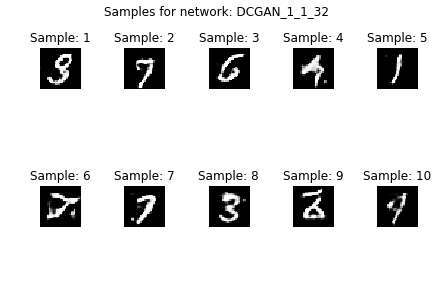
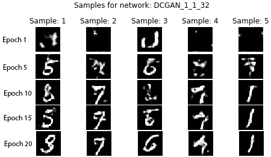
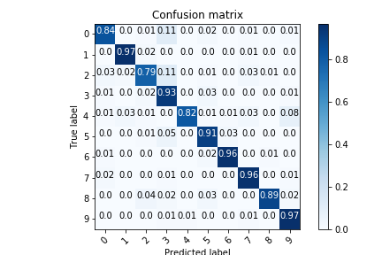

# Generative adversarial networks for generating numbers trained on the MNIST dataset
This work looks at training and testing of generative adversarial networks (GANs) to generate synthetic hand-written digit images from the MNIST dataset. Their performance has been evaluated visually through inspection and an inception score that was calculated using a pre-trained LeNet.

This project was a part of coursework for module EE4-62 Selected Topics for Computer Vision at Imperial College London, [Link](http://intranet.ee.ic.ac.uk/electricalengineering/eecourses_t4/course_content.asp?c=EE4-62&s=J4#start).

## Structure
```
.
├── Figures
├── README.md
├── Report.pdf
├── Resources
├── data
├── requirements.txt
└── src

```
The `Figures` directory contains the Figures that were used in the [Report](Report.pdf). `src` Contains all the sourcecode to generate the best models for both the DCGAN and CCGAN that are mentioned in the [Report](Report.pdf). The data should be loaded/will be processed under the `data` directory.

All the outcomes are summarized in the [Report](Report.pdf).

## Approach

The work considered the originally introduced architectures for [DCGAN](https://arxiv.org/abs/1511.06434) and CCGAN (https://github.com/eriklindernoren/Keras-GAN/blob/master/ccgan/ccgan.py) which were modified to give the best performance which was measured through inspection in case of a DCGAN and inception score through a LeNet in case of a CCGAN. Additionally, this work explored the leverage to which the CCGAN can be trained on synthetic images. Last but not least, probabilistic principle component analysis (PPCA) was used to generated images as a reference in addition to DCGAN and CCGAN.

DCGAN generated numbers |  CCGAN generated numbers
:-------------------------:|:-------------------------:
  |  

## Evaluation

We conducted experiments with DCGAN, CCGAN and PPCA for generation of sample images based on the MNIST dataset. The best inception score that was measured with the best CCGAN architecture achieved 97.6% accuracy. When augmenting the dataset with synthetic GAN generated images, the best performance was achieved when the entire real training data was used. When finding the best performance of PPCA as a generative model, it was interesting to note that there were a points of significant sudden change in the gradient. Referring to it as a saddle point, found to be at ∼64 components, it was chosen to be the best dimensional space to generate images. This is because higher dimensions introduced a significant time penalty for an accuracy difference of approximately 1.5%.

DCGAN generated numbers |  Confusion Matrix for the best CCGAN
:-------------------------:|:-------------------------:
  |  


## Building & Running
To train and generate all the Figures for the winning models just run inside the `src` directory:

```bash
virtualenv -p python3 venv
source venv/bin/activate
pip install -r ../requirements.txt
jupyter notebook
# Navigate to the respective notebook
```

and the Figures will be found in `Figures/<name>/`

## Credits
Martin Ferianc, Divyansh Manocha 2019.
